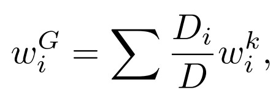

# 基于隐私保护联邦学习的工业物联网入侵检测

## 1 论文介绍

- 论文地址：[下载地址](https://www.researchgate.net/publication/356073751_Intrusion_Detection_based_on_Privacy-preserving_Federated_Learning_for_the_Industrial_IoT)

- 最相关的论文： “Fed+：联邦学习的融合算法家族”。P. Yu, L. Wynter, and S. H. Lim, “Fed+: A family of fusion algorithms

  for federated learning,” *arXiv preprint arXiv:2009.06303*, 2020.

  

  
#### 1.1 背景及意义

- 随着物联网的发展，与物联网设备和系统相关的安全漏洞和威胁的数量和影响显著増加。为了应对这些担忧，入侵检测系统（ IDS ）成为了早期检测物联网攻击和网络威胁的方法。近年来， IDS 机制通常基于人工智能技术，使系统与设备的网络流量进行训练，以准确检测任何异常行为。然而基于AI的IDS在圳练时引发了隐私问题，因为不同的域可能需要共享它们的私人数据。
- 联邦学习作为一种协作学习方法仍面临隐私问题，为了减轻这种隐私问题，可以使用差分隐私(DP)来混淆训练数据或模型更新，给数据的隐私保证
- 但现有的工作没有在IDS方法的范围内分析这类技术的影响，也没有解决考虑非独立同分布（非IID）数据分布的不同聚合方法的影响。

#### 1.2 主要内容

这篇论文的工作重点是在不同隐私要求下评估几种差分隐私技术，以在隐私和准确性之间找到一个折衷。

-  文章通过几种**基于高斯和拉普拉斯分布的加性噪声技术**对差分隐私方法进行了全面的评估（这些加性噪声技术应用于工业物联网(IIoT)的联邦学习支持的IDS的训练中）
-  与以前的方法不同，作者使用的评估方法是基于一个实例选择过程来处理最近Ton_IoT数据集上的非IID数据分布，该数据集包含与此类场景相关的最近攻击。 
-  与当前的技术状况不同，作者的评估比较了使用不同的差分隐私技术和最近提出的聚合函数FED+获得的精度，该函数与传统的FedAvg函数相比提供了明显更好的精度结果。据作者所知，这是第一次在IoT/IIoT场景中分析非IID数据和聚合功能对实现隐私保护的联邦学习支持的IDS的影响。 
-  文章的主要贡献和创新点如下：
     1. 全面评估应用支持差分隐私的FL检测物联网场景中的攻击的可行性和性能，考虑非独立同分布数据分布，调整和划分ToN_IoT数据集。 
     2. 将不同的FL聚合方法与DP技术结合使用，并对它们对物联网入侵检测有效性的影响进行了实证分析。 
     3. 首次完成了在不同隐私因子值和FL设置下，应用于物联网入侵检测的不同DP扰动机制的定量和计算性能分析。
## 2 保护隐私的联邦学习

## 3 面向IoT/IIoT隐私保护联邦学习的入侵检测

下面描述所提出的体系结构和算法。 表一为本章使用的主要变量和术语。 

#### A.支持差分隐私的联邦学习

##### 训练流程

图1显示的是本篇论文的总体架构。 

- 客户端代表执行本地训练的终端设备。
- 每个客户端负责训练聚合器发送的全局模型及其本地数据，并生成模型更新。 
- 客户端被赋予应用相应差分隐私算法所需的逻辑。
- 聚合器：接收来自客户机的模型更新并生成聚合模型的中央服务，在每个训练回合中被发送回客户端。 

考虑到在联邦训练使用差分隐私，每个训练回合的流程如下： 

1. 聚合器使用一个**特定的客户选择方法**来选择一组客户参与训练过程。（在IoT中，例如，电池消耗等条件） 
2. 在初始训练回合时，聚合器创建一个新的通用模型$W^G$，其权重$W^G_i$被发送给选定的客户端。或者，聚合器根据客户端提供的更新，使用特定的聚合函数创建聚合模型，将得到的聚合模型发送到客户端。（论文比较了FedAvg和Fed+两种聚合方法，第四节会讲）。  
3. 每个客户端接受共享模型，并用本地数据对其进行训练，用本地训练产生的权重$\Delta W^k_i$生成特定的模型更新。 客户执行epochs的数量是由$epochs E$的数量决定的。 
4. 客户端利用差分隐私机制匿名计算的权重（在这一步骤中应用的**差分隐私扰动机制**可以是B.中定义的方法之一） 然后，所得到的匿名权重$\Delta W_i$被发送回聚合器实体。 
5. 聚合器使用诸如FedAvg等聚合算法组合所有接收到的模型更新，生成新的全局模型。 

重复这些步骤，直到达到一定的轮数$R$，或者满足另一个条件（比如达到一定的目标精度）。 

##### 算法描述

算法就是将上面的流程用伪代码表示了一下，展示了每一轮应用的联邦学习聚合方法和差分隐私机制之间的融合和关系。

#### B.差分隐私的扰动机制

##### 其他方法

> 定义1（机制）：机制κ是一个随机函数，它接受一个数据集D并输出一个随机变量κ(D)。 

如定义1所示，输出扰动机构取一个输入D，并返回一个随机变量$κ(D)$。这样的随机变量是通过函数$f:X→R^d$将输入数据的变换加上某个随机噪声，该随机噪声遵循一定的分布$rn$，因此我们可以将$(ε,δ)−DP$表示为$κ(D)=f(D) + rn$。

本文分析的扰动方法总结如下:

- **截断拉普拉斯机制**：给定隐私参数$0<δ<\frac{1}{2},ε>0$和查询灵敏度$\Delta>0$，截断拉普拉斯分布函数$f_{TLap}$的密度概率定义为：

- **一致**：当$ε=0$时是截断拉普拉斯机制的特例。

- **高斯**：对于任意$ϵ,δ∈(0,1)$高斯输出扰动机制为： 

  

- **解析高斯机制**：设$f:X→R^d$是具有全局$L_2$灵敏度的函数。 对于任意$ϵ≥0$和$δ∈[0,1]$，高斯输出微扰机制:$M(x)=f(x)+Z$ 其中$Z∼N(0,σ^2I)$是$(ϵ,δ)-DP$ 当且仅当： 

  

- **有界区域拉普拉斯机制**：给定$b>0$和$D \subset R$有界Laplace机制$W_q:Ω→D$，对于每个$q∈D$，由其概率密度函数$f_{W_q}$给出： 

- 

- **有界拉普拉斯噪声机制**：此算法在k个坐标中的每个坐标中添加独立噪声，这些坐标取自$(-R,R）$中支持的分布$μ_{DE,R}$： 

  - 其中$\vec{x}^{(n)}$和每个$η_i$是独立于分布$μ_{DE,R}$得到的。 设$e∈(0,1),k∈N$和$δ≥e^{\frac{-k}{log^8k}}$。 定义$R=\frac{C}{ϵn}\sqrt {log(\frac{1}{δ})}$，其中$C>0$是通用常数，则$M_{DE,R}$是$(ϵ,δ)-DP$。 

##### 作者的方法

可以从差分隐私方法的定义中了解到，扰动的水平将高度依赖于所选择的参数。因此，作者使用**皮尔逊相关**分析扰动权重和原始权重之间的相似性是如何受到影响。 

- 这个系数是两个变量线性关联的量度，范围-1到+1。 +1表示数据对象完全相关，-1表示数据对象不相关。 

- 皮尔逊相关系数本质上是两个变量的协方差与标准差之间的比值。 在数学形式上，系数可以描述为： 

  

  - $r$ 为相关系数
  -  $x_i$表示样本中x变量的值
  - $\overline x$ 是x变量值的平均值
  -  $y_i$表示示例中y变量的值
  -  $\overline y$是y变量值的平均值

在我们的方法中，公式8定义的皮尔森相关系数是在应用差分隐私机制之前和之后的每一个训练轮的模型更新上计算的。 这意味着该度量指示每个客户机的原始权重和修改后的权重之间的相似性。
## 4 方法论述

#### A.数据集描述 
##### 数据的来源

本工作中使用的数据集基于CIC-ToN_IoT数据集，该数据集是通过CICFlowMeter工具从Ton-IoT数据集的PCAP文件中提取的83个特征。
##### 数据的处理

- 第一步，删除非数字特征。然后，根据目的IP地址，即受害者的地址，对整个数据集的样本进行分离，然后按照样本数的顺序删除与前10个IP地址不对应的样本。得到的数据集包含4.404.084个样本，相当于原始CIC-ToNIoT2的82.29%。
- 同时，由于得到的数据集高度不平衡，使用香农熵来衡量每一个数据集的不平衡程度。(防止不平衡和非独立同分布数据对情景联邦学习的影响）具体地说，给定长度为n的数据集$c_i$和大小为的k个类，类之间的平衡由公式给出： 

其中，如果1个以上类都为0，则函数等于0，如果所有$c_i=\frac{n}{k}$，则函数等于1。
- 我们认为一个联邦学习客户端由一个受害者IP地址表示。 在这个上下文中，假定每个实例代表一个网络流，N是网络流的数量，K是攻击类的数量，$c_i$是i类实例的数量。 
##### 数据集的选择

- 表二说明了不同集合的数据分布情况，包括每个集合的类别分布和熵值。 基于这些值，作者选择熵值高于0.2的各方，因此选择第0、2、4和5方作为我们场景的联邦学习客户。 

- 在第一步之后，由于每个局部数据集的类不是很平衡的，作者使用了一种简单的基于欠采样的实例选择机制，该机制包括从优势类中去除随机样本，直到达到高于0.6的熵水平。 首先，从这些类中选择满足熵要求的实例，然后随机删除这些实例。 表三汇总了被选中的数据集的分布情况。

#### B.多类分类
使用监督学习考虑多类方法来将数据集实例分类为良性攻击或特定攻击，即：DoS、DDoS、后门、注入、MITM、扫描、密码和XSS。 
具体上是应用了多项式logistic回归，以将模型系数解释为特征重要性的指标。 与大多数分类器一样，为了正确使用算法，输入变量需要独立。 给定输入x，目标是知道y（标签）在每个潜在类p(y=cx)中的概率。 Softmax函数取k个任意值的向量z，并将它们映射到如下所示的概率分布： 

在我们的例子中，softmax的输入将是权重向量w和输入向量x之间的点积加上k个类中每一个的偏置： 

多项式logistic回归的损失函数是二元logistic回归损失函数的推广，称为交叉熵损失或对数损失。 虽然可以使用其他受监督的技术，但应该指出，我们的工作重点是分析差分隐私技术的影响，考虑到联邦学习环境中不同的隐私要求和聚合功能。 

#### C.聚合职能
##### FedAvg

联邦学习每个客户生成的本地更新在每一轮训练中通过聚合功能合并。 最基本的聚合函数由FedAvg表示，它根据联邦学习客户端生成的权重的平均值生成全局模型。 特别地，设$W^G=(w^G_i)$是一般模型的权重，$W^k=(w^k_i)$是数据集k的权重，则： 

​										其中D和$D_i$分别为每一方的总数据大小和数据大小。 

然而在本例中FedAvg的性能可能会在非独立同分布和高度倾斜数据的情况下下降。

##### Fed+

在这项工作中，还考虑了最近的一种称为Fed+的方法，它将几个函数统一起来，以应对由异构数据分布组成的场景。 出于这一目的，Fed+放宽了强制各方趋同于单一模式的要求。 特别是，让它成为FedAvg中的主要目标：
 					

​					其中$f_k$是数据集k的局部损失函数。 

就Fed+而言，主要目标是：
 

- $W$是全局模型权重
- $W^k$是参与者k的模型权重
- $B(·,·)$是距离函数
- $α_i>0$是惩罚常数
- $C$是计算$w$的中心点的集合函数

然后，为了计算每一轮的权重，各方生成各自的$W^k$，并将其发送给聚合器。 之后，聚合器计算$C(W)$的值，然后将其发送给各方。 最后，各方通过以下方式计算新模型的权重： 

- $γ^k$是学习速率
- $W^k_r$代表参与者k在$r$轮中的权重

## 5 评价结果 

本节描述了通过在Ton_IoT数据集上使用logistic回归分类器将前面描述的每一种差分隐私机制应用于联邦学习训练场景所取得的评估结果。 主要的性能评价参数是，扰动差分隐私机制和要应用的聚集算法。 图2和图3显示了每一个机制的精确度和不同的值在整个回合中的演变。

 对于第一种算法，FEDAVG被配置为每轮使用的聚合算法，而对于第二种算法，则使用FED+。 提醒一下，更小的提供了更好的隐私保护方案。 评估还比较了在不应用差分隐私技术的情况下使用联邦学习时所达到的精度。 

对于高斯分析机制，可以取高于1的值。 图2显示，所有值的精确度水平都高于0.8，我们获得了与没有差分隐私的配置类似的结果，这意味着我们的框架几乎不影响精确度，同时提供了比经典联邦学习方法更多的隐私。 此外，高斯机制，如图2所示，对每个值都达到接近的精度值，即使使用非DP配置。 总的来说，在这两种情况下，在所有情况下，前10轮都有明显的提高，然后精确度稳定下来。 

此外，图2显示了拉普拉斯有界域和拉普拉斯有界噪声机制的相同信息。 在这种情况下，与在前面的机制中一样，对于不同值的精度值非常接近，即使对于每一个和非差分隐私配置，对于Laplace有界噪声在30轮处和对于Laplace有界域在20轮处的精度水平降低。 在均匀机构的情况下，应该注意的是，精确度值在整个轮次中明显降低。 

此外，图3显示了使用fed+作为聚合算法的结果。 在这种情况下，精确度值的演化明显上升，直到所有机制中的每一个都上升到第10轮。 与FEDAVG相比，最后一轮的最终精度水平略好，除了均匀机制，它比FEDAVG有明显的更高的精度水平，因为FED+对非独立同分布数据的表现更好，这就是我们的情况。 根据3,在大多数情况下，使用我们的差分隐私策略的精确度在没有任何扰动的情况下超过了场景的精确度。 这可以用这样一个事实来解释，即运行随机梯度下降(SGD)和有噪声的梯度估计可以帮助模型的性能[17]，而有噪声的数据高于某个阈值。 此外，这种现象以前在其他最先进的研究中也观察到过，与我们相比，这些研究以更有限的方式将差分隐私应用于联邦学习，但在某些情况下混淆数据时获得了更好的准确性[18]。 

理论上，越低的值，由于隐私因素的增加，最终模型应该达到较低的精度值，因为权值越模糊。 然而，如图2和图3所示，对于几乎所有的扰动机制和两种聚合算法，使用限制最严格的值（较低）和使用最宽松的值（较高）的机制所达到的精度之间没有很大差异。 然而，使用FEDAVG和一些机制，如拉普拉斯截断或高斯，很明显，限制越多，整个轮的精度就越低。 

此外，还应该指出，每种机制实现的隐私增强是由到PCC值1的距离给出的，这将代表经典的联邦学习场景，其中没有对数据应用扰动机制，因此根本没有混淆。 表IV显示了每个扰动机制的平均皮尔森相关系数(PCC)值和不同的值。 应当指出，对于所有机制，数值越低，PCC越低。 这表明，实际上，较低的值实现了更模糊的权重集，因此，更高的隐私系数。 正如可以看到的，uniform是一种机制，它提供了一组更模糊的权重，并因此提供了最低的PCC。 因此，与本文分析的其他差分隐私技术相比，该机制提供了最高的隐私因子。 此外，当使用FED+时，与其他差分隐私技术相比，均匀机制也提供了类似的精度水平，如图3所示。 因此，考虑到PCC值和所提方案的准确性，它提供了最佳的结果。 

最后，图4显示了每个机制的执行时间的方框图。 这个图形是每个机制对于相同的ε(=1)执行10次不同的结果，除了统一机制，因为它只接受=0。 对于每次执行，测量摄动过程中花费的时间，然后在图形中的每个方框中显示最大、最小和平均时间。 

## 6 结论

虽然联邦学习是为了避免缔约方共享其数据而创造的，但它仍然面临着与每一轮训练中梯度/权重通信相关的隐私问题。 为了解决这一问题，本文对基于加性噪声机制的差分隐私技术的使用进行了详尽的评估，并将其应用于Ton_IoT数据集的联邦训练过程中，为IoT场景提出了一个保护隐私的入侵检测。 

我们比较了基于高斯分布和拉普拉斯分布的不同噪声添加技术，并评估了使用Fed+作为FedAvg的替代聚合函数获得的准确性，该函数最近被提出来处理现实世界中普遍存在的非iid数据分布。 

**根据我们的评估结果，这类差分隐私技术的使用保持了可接受的准确性水平，在低隐私要求（即高价值）的情况下，甚至接近非差分隐私场景。 在Fed+的情况下，差分隐私技术对准确性的影响是不可察觉的。** 

据我们所知，这项工作是首次在考虑不同聚合功能的情况下，对IIoT中的联邦学习支持的入侵检测进行全面评估。

 作为未来的工作，我们将分析每个设备具有不同隐私需求的个性化联邦学习方法的发展，以及在具有网络约束的IIoT场景中考虑使用梯度压缩技术。 

## 笔记

### 拉普拉斯噪声

在应用差分隐私进行隐私保护中，需要处理的数据主要分为两大类，一类是`数值型`的数据，比如说数据集中已婚人士的数量；另外一类是`非数值型`的数据，比如喜欢人数最多的颜色。这两者，主体分别是`数量(连续数据)`和`颜色(离散数据)`

- 对于`数值型`的数据，一般采用`Laplace`或者`高斯`机制，对得到数值结果加入随机噪声即可实现差分隐私

- 而对于`非数值型`的数据，一般采用`指数`机制并引入一个`打分函数`，对每一种可能的输出都得到一个分数，归一化之后作为查询返回的概率值。

  https://zhuanlan.zhihu.com/p/144318152

### 拉普拉斯分布

顾名思义，拉普拉斯机制本身代表一种随机噪声的添加机制，而拉普拉斯机制这个名字，就是来源于噪声所产生的分布：拉普拉斯分布。定义2：对于一个期望为0，尺度为b的拉普拉斯分布，其概率密度函数为：

$p(x)=\frac{1}{2 b} \exp \left(-\frac{|x|}{b}\right)$

其函数图像如下图所示：

链接：https://juejin.cn/post/7100804661384314916 来源：稀土掘金代替

### 高斯

添加拉普拉斯噪声的另一种方法是添加高斯噪声。在这种情况下，我们不是将噪声缩放到 ℓ1 灵敏度Δ*f*，而是缩放到 ℓ2 灵敏度：

**定义3.8（ℓ2-敏感度）** 一个方法$f:N^{∣X∣}→R^k$ 的ℓ2-敏感度为：

$\Delta_2(f)=\max_{x,y\in\mathbb{N}^{|\mathcal{X}|},\Vert x-y\Vert _1=1}\Vert f(x)-f(y)\Vert _2$

参数为$ b$的高斯机制在每个$ k$协调中添加方差为的零$ b$均值高斯噪声。以下定理在附录A中得到了证明。

**定理 3.22**。设 $\varepsilon\in(0,1)$是任意的。当$ c^2>2\ln(1.25/\delta)$ 时，参数 \sigma\geq c\Delta_2(f)/\varepsilon*σ*≥*c*Δ2(*f*)/*ε* 的高斯机制是 (\varepsilon,\delta)(*ε*,*δ*)-差分隐私的。

高斯噪声的优点之一是为隐私而添加的噪声与其他噪声源具有相同的类型；另外，两个高斯的和是高斯的，因此隐私机制对统计分析的影响可能更容易理解和修正。

这两种机制在组合下产生相同的累积损失，因此即使对于每个单独合成来说,隐私保证较弱，但在许多计算中的累积影响是可比较的。此外，如果 \delta*δ* 足够小（例如，亚多项式），在实践中，我们将永远不会遇到差分隐私保证的不足之处。

也就是说，相对于拉普拉斯噪声，高斯噪声在理论上是有缺点的。考虑 **Report Noisy Max**（带有拉普拉斯噪声）算法下，每个候选输出在数据库 x*x* 上的效用得分与其在相邻数据集 y*y* 上的效用分数相同。该机制产生 (\varepsilon,0)(*ε*,0)-差分隐私，与候选输出的数量无关。如果我们使用高斯噪声并报告最大值，并且如果候选值的数量比 1/\delta1/*δ* 大，那么我们将精确地选择发生概率小于 δ*δ* 的具有大高斯噪声的事件。当我们远离高斯分布的尾时，我们不再能保证在 x,y*x*,*y* 数据库的观测概率的差别在 e^{\pm\varepsilon}*e*±*ε* 因子内。